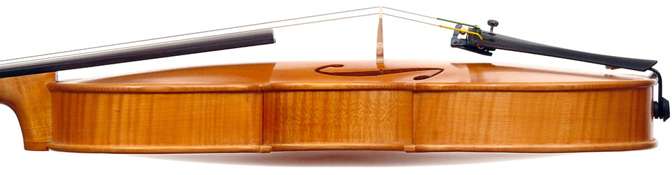

---
#
# By default, content added below the "---" mark will appear in the home page
# between the top bar and the list of recent posts.
# To change the home page layout, edit the _layouts/home.html file.
# See: https://jekyllrb.com/docs/themes/#overriding-theme-defaults
#
layout: home
---

(We need some brief summary info here, with a link to the full [Biographical Sketch](bio/) and to other relevant things like her SOM faculty page, UNCG Strings programs she teaches in, etc.)

## News and Announcements

